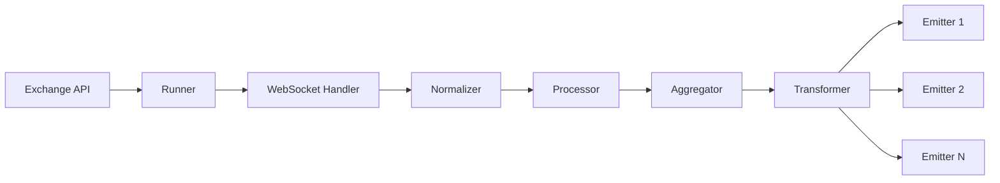

# Core Concepts

Understanding StreamForge's architecture will help you build robust, maintainable data pipelines.

---

## Architecture Overview

StreamForge follows a simple data flow:



Let's understand each component:

---

## 1. DataInput

**DataInput** is your configuration object. It tells StreamForge *what* data to stream.

```python
import streamforge as sf

stream = sf.DataInput(
    type="kline",                           # Data type
    symbols=["BTCUSDT", "ETHUSDT"],        # Trading pairs
    timeframe="1m",                         # Candle interval
    aggregate_list=["5m", "15m", "1h"]     # Optional aggregation
)
```

### Attributes

| Attribute | Type | Description | Example |
|-----------|------|-------------|---------|
| `type` | `str` | Data stream type | `"kline"`, `"candle"`, `"ohlc"` |
| `symbols` | `list[str]` | Trading pairs to track | `["BTCUSDT"]` |
| `timeframe` | `str` | Candle interval | `"1m"`, `"5m"`, `"1h"` |
| `aggregate_list` | `list[str]` | Higher timeframes (optional) | `["5m", "1h"]` |

### Supported Types

Different exchanges use different names:

| Exchange | Type Name | Description |
|----------|-----------|-------------|
| Binance | `kline` | Candlestick/OHLC data |
| OKX | `candle` | Candlestick/OHLC data |
| Kraken | `ohlc` | Candlestick/OHLC data |

### Symbol Formats

Each exchange has its own symbol format:

=== "Binance"
    ```python
    symbols=["BTCUSDT", "ETHUSDT", "SOLUSDT"]
    # Format: BASEQUOTE (no separator)
    ```

=== "OKX"
    ```python
    symbols=["BTC-USDT", "ETH-USDT", "SOL-USDT"]
    # Format: BASE-QUOTE (dash separator)
    ```

=== "Kraken"
    ```python
    symbols=["BTC/USD", "ETH/USD", "SOL/USD"]
    # Format: BASE/QUOTE (slash separator)
    ```

---

## 2. Runner

**Runner** manages the entire data pipeline for a specific exchange.

```python
runner = sf.BinanceRunner(stream_input=stream)
```

### Responsibilities

1. **Connection Management** - WebSocket lifecycle
2. **Data Flow** - Coordinates all components
3. **Error Handling** - Reconnection logic
4. **Emitter Registry** - Manages output destinations

### Available Runners

```python
# Binance
runner = sf.BinanceRunner(stream_input=stream)

# Kraken
runner = sf.KrakenRunner(stream_input=stream)

# OKX
runner = sf.OKXRunner(stream_input=stream)
```

### Configuration Options

```python
runner = sf.BinanceRunner(
    stream_input=stream,
    active_warmup=True,      # Load today's data (used in aggregation)
    emit_warmup=False        # Don't emit warmup data
)
```

| Parameter | Type | Default | Description |
|-----------|------|---------|-------------|
| `stream_input` | `DataInput` | Required | Stream configuration |
| `active_warmup` | `bool` | `False` | Load historical data for context |
| `emit_warmup` | `bool` | `False` | Emit historical data too |

!!! info "Warmup"
    Warmup loads historical data before streaming. Required for aggregation.
    
    - `active_warmup=True` - Load history for context
    - `emit_warmup=True` - Also emit historical data

---

## 3. Emitters

**Emitters** define *where* data goes. You can register multiple emitters.

```python
runner.register_emitter(emitter)
```

### Built-in Emitters

#### CSV

Save to CSV file:

```python
csv = sf.CSVEmitter(
    source="Binance",
    symbol="BTCUSDT",
    timeframe="1m",
    file_path="data.csv"
)
runner.register_emitter(csv)
```

#### PostgreSQL

Save to database:

```python
postgres = sf.PostgresEmitter(
    host="localhost",
    dbname="crypto",
    user="postgres",
    password="secret"
)
postgres.set_model(MyTable)
runner.register_emitter(postgres)
```

#### Kafka

Stream to Kafka:

```python
kafka = sf.KafkaEmitter(
    bootstrap_servers="localhost:9092",
    topic="crypto-stream"
)
runner.register_emitter(kafka)
```

### Multiple Emitters

Data flows to **all** registered emitters:

```python
# Register 3 emitters
runner.register_emitter(csv)
runner.register_emitter(postgres)
runner.register_emitter(kafka)

# Data goes to all 3!
await runner.run()
```

[Emitters Guide →](../user-guide/emitters.md)

---

## 4. Processors

**Processors** handle incoming data internally. You typically don't interact with them directly.

### What They Do

- Buffer incoming messages
- Parse WebSocket frames
- Convert to normalized format
- Aggregate timeframes
- Apply transformations


---

## 5. Normalizers

**Normalizers** convert exchange-specific formats to a unified `Kline` model.

### Purpose

Different exchanges send different formats:

```python
# Binance format
{
    "e": "kline",
    "s": "BTCUSDT",
    "k": {
        "t": 1735689600000,
        "o": "43250.00",
        "h": "43275.00",
        ...
    }
}

# Normalized format (all exchanges)
Kline(
    source="Binance",
    symbol="BTCUSDT",
    timeframe="1m",
    open_ts=1735689600000,
    open=43250.00,
    high=43275.00,
    ...
)
```

### Kline Data Model

```python

from typing import List, Any, Optional
from pydantic import BaseModel, Field, AliasChoices, field_validator

class Kline(BaseModel):
    
    # Metadata Variables
    source: Optional[str] = Field(None, alias="source", validation_alias=AliasChoices("source"))
    symbol: str = Field(alias="s", validation_alias=AliasChoices("s", "symbol", "ticker", "pair"))
    timeframe: str = Field(alias="i", validation_alias=AliasChoices("i", "timeframe", "tf"))

    # Time related Variables
    open_ts: int = Field(alias="t", validation_alias=AliasChoices("t","interval_begin","ts"))
    end_ts: int = Field(alias="T", validation_alias=AliasChoices("T","timestamp"))

    # Price Variables
    open: float = Field(alias="o", validation_alias=AliasChoices("o", "open", "open_price"))
    high: float = Field(alias="h", validation_alias=AliasChoices("h", "high", "high_price"))
    low: float = Field(alias="l", validation_alias=AliasChoices("l", "low", "low_price"))
    close: float = Field(alias="c", validation_alias=AliasChoices("c", "close", "close_price"))

    # Volume Variables
    volume: float = Field(alias="v", validation_alias=AliasChoices("v", "volume", "base_volume"))
    quote_volume: Optional[float] = Field(None, alias="q",validation_alias=AliasChoices("q", "quote_volume", "Quote asset volume"))
    vwap: Optional[float] = Field(None, alias="vwap", validation_alias=AliasChoices("vwap", "volume_weighted_avg_price"))
    n_trades: Optional[int] = Field(None, alias="n", validation_alias=AliasChoices("n", "count", "trades"))
    is_closed: Optional[bool] = Field(None, alias="is_closed", validation_alias=AliasChoices("is_closed", "x"))

    ... # methods
```

---

## 6. Aggregators

**Aggregators** create higher timeframe candles from base candles.

### How It Works

Stream 1-minute candles, get 5m/15m/1h automatically:

```python
stream = sf.DataInput(
    type="kline",
    symbols=["BTCUSDT"],
    timeframe="1m",                      # Base timeframe
    aggregate_list=["5m", "15m", "1h"]  # Aggregate to these
)

runner = sf.BinanceRunner(
    stream_input=stream,
    active_warmup=True  # Required for aggregation!
)
```

### Rules

- Base timeframe must be smaller than aggregate timeframes
- Aggregation preserves OHLCV integrity
- Requires warmup for accurate candles in aggregation

Example:

```python
# ✓ Valid
timeframe="1m", aggregate_list=["5m", "1h"]

# ✗ Invalid
timeframe="1h", aggregate_list=["5m"]  # Can't aggregate down
```

[Aggregation Guide →](../user-guide/aggregation.md)

---

## 7. Transformers

**Transformers** modify data before it reaches emitters.

```python
def my_transformer(data: dict) -> dict:
    """Add computed fields"""
    return {
        **data,
        "price_range": data["high"] - data["low"],
        "is_bullish": data["close"] > data["open"]
    }

emitter.set_transformer(my_transformer)
```

### Use Cases

- Rename fields
- Add computed columns
- Convert units
- Filter data

[Transformers Guide →](../user-guide/transformers.md)

---

## 8. Backfilling

**Backfilling** loads historical data instead of streaming live data.

```python
backfiller = sf.BinanceBackfilling(
    symbol="BTCUSDT",
    timeframe="1m",
    from_date="2024-01-01",
    to_date="2024-12-31"
)

backfiller.register_emitter(postgres_emitter)
backfiller.run()  # Sync, not async!
```

[Backfilling Guide →](../user-guide/backfilling.md)

---

## Data Flow Example

Let's trace a complete data flow:

```python
import asyncio
import streamforge as sf

async def main():
    # 1. Configure what to stream
    stream = sf.DataInput(
        type="kline",
        symbols=["BTCUSDT"],
        timeframe="1m"
    )
    
    # 2. Create runner
    runner = sf.BinanceRunner(stream_input=stream)
    
    # 3. Add emitter
    runner.register_emitter(some_emitter)
    
    # 4. Start!
    await runner.run()

asyncio.run(main())
```

### What Happens

1. **Runner** connects to Binance WebSocket
2. **WebSocket** receives raw JSON message
3. **Normalizer** converts to `Kline` object
4. **Processor** buffers and validates
5. **Emitter** receives `Kline` and logs it

---

## Execution Modes

StreamForge has two execution modes:

### 1. Internal Run Mode (async) (.run())

For real-time WebSocket streaming internally:

```python
async def main():
    runner = sf.BinanceRunner(stream_input=stream)
    runner.register_emitter(emitter)
    await runner.run()  # Async

asyncio.run(main())
```

### 2. Streaming Mode (async) (.stream())

For real-time WebSocket streaming and handling data manually:

```python
runner = sf.BinanceRunner(
    stream_input=sf.DataInput(
        type="kline",
        symbols=["BTCUSDT"],
        timeframe="1m"
    )
)
    
# No emitters registered - we'll handle data manually

async for kline in runner.stream():
    # Custom logic for each data point
    price = kline.close
    
    # Example: Only log when price crosses certain thresholds
    if price > 50000:
        print(f"🚀 BTC above $50k! Current: ${price:,.2f}")
    elif price < 30000:
        print(f"📉 BTC below $30k! Current: ${price:,.2f}")
    else:
        print(f"📊 BTC: ${price:,.2f}")
```

### 3. Backfill Mode (sync)

For historical data loading:

```python
def main():
    backfiller = sf.BinanceBackfilling(
        symbol="BTCUSDT",
        timeframe="1m",
        from_date="2024-01-01",
        to_date="2024-12-31"
    )
    backfiller.register_emitter(emitter)
    backfiller.run()  # Sync

main()
```

---

### Automatic Reconnection

WebSocket disconnects are handled:

```python
# Runner automatically reconnects on:
# - Network errors
# - Exchange disconnects
# - Timeout errors
```

---

## Advanced: Stream Iterator

For advanced use cases, use the stream iterator:

```python
async def main():
    runner = sf.BinanceRunner(stream_input=stream)
    
    # Iterate over data manually
    async for kline in runner.stream():
        print(f"Received: {kline.symbol} @ ${kline.close}")
        
        # Custom logic here
        if kline.close > 50000:
            print("BTC above $50k!")
```

This gives you full control over data handling.

---

## Performance Tips

### 1. Use Appropriate Timeframes

Higher timeframes = less data:

```python
# More data
timeframe="1m"  # 1440 candles/day

# Less data  
timeframe="1h"  # 24 candles/day
```

### 2. Limit Symbols

Only stream what you need:

```python
# Better
symbols=["BTCUSDT"]

# More load
symbols=["BTCUSDT", "ETHUSDT", ..., "100 symbols"]
```


## Key Takeaways

1. **DataInput** - Configures *what* to stream
2. **Runner** - Manages the pipeline
3. **Emitters** - Define *where* data goes
4. **Normalizers** - Unify exchange formats
5. **Aggregators** - Create higher timeframes
6. **Transformers** - Modify data
7. **Backfilling** - Load historical data

---

## What's Next?

<div class="grid cards" markdown>

-   :material-database-export: **[Emitters](../user-guide/emitters.md)**
    
    Deep dive into output destinations

-   :material-function: **[Transformers](../user-guide/transformers.md)**
    
    Learn data transformation

-   :material-chart-timeline: **[Aggregation](../user-guide/aggregation.md)**
    
    Multi-timeframe streaming

-   :material-code-braces: **[Examples](../examples/index.md)**
    
    See it all in action

</div>

