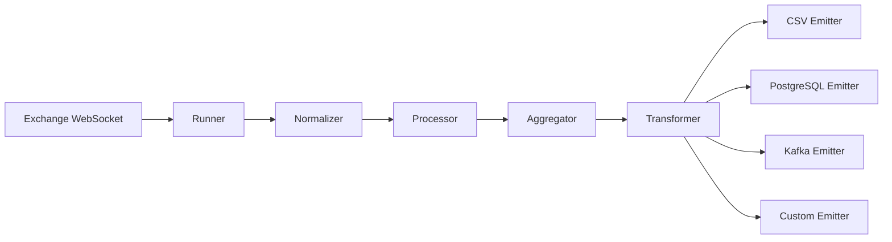

# StreamForge

<p align="center">
  <strong>Real-time cryptocurrency and financial data ingestion made simple</strong>
</p>

<p align="center">
  <a href="https://badge.fury.io/py/streamforge"></a>
  <a href="https://pypi.org/project/streamforge/"></a>
  <a href="https://opensource.org/licenses/MIT"></a>
</p>

<p align="center">
  <a href="getting-started/installation/" class="md-button md-button--primary">Get Started</a>
  <a href="examples/" class="md-button">View Examples</a>
</p>

---

## What is StreamForge?

StreamForge is a unified, async-first framework for ingesting real-time market data from cryptocurrency exchanges. Built with Python's asyncio, it offers high-performance data streaming, normalization, and multiple output formats.

### Key Features

- :material-flash: **Real-time WebSocket Streaming** - Live market data from multiple exchanges
- :material-database: **Multiple Output Formats** - CSV, PostgreSQL, Kafka
- :material-swap-horizontal: **Multi-Exchange Support** - Binance, Kraken, OKX with unified API
- :material-chart-timeline: **Timeframe Aggregation** - Automatic aggregation to higher timeframes
- :material-history: **Historical Backfilling** - Load months of historical data effortlessly
- :material-tune: **Data Transformation** - Built-in transformers for custom data processing
- :material-merge: **Stream Merging** - Combine multiple exchanges into unified streams
- :material-language-python: **Type-Safe** - Full type hints and Pydantic validation

---

## Quick Start

Install StreamForge in seconds:

```bash
pip install streamforge
```

Stream Bitcoin data in 3 lines:

```python
import asyncio
import streamforge as sf

async def main():
    # Configure what to stream
    stream = sf.DataInput(type="kline", symbols=["BTCUSDT"], timeframe="1m")
    
    # Create runner and add logger
    runner = sf.BinanceRunner(stream_input=stream)
    
    
    # Start streaming!
    await runner.run()

asyncio.run(main())
```

**Output:**
```
2025-10-14 16:21:32 - INFO - Aggregation Deactivated
2025-10-14 16:21:33 - INFO - Binance    | Subscribed Successful to params: {'method': 'SUBSCRIBE', 'params': ['btcusdt@kline_1m'], 'id': 999} | Websocket Input: DataInput(type='kline', symbols=['BTCUSDT'], timeframe='1m', aggregate_list=[]).
2025-10-14 16:21:33 - INFO - Binance    | Websocket Connection established successfully!
2025-10-14 16:22:00 - INFO - Binance    | Data Received: source='binance' symbol='BTCUSDT' timeframe='1m' open_ts=1760469660 end_ts=1760469719 open=113329.98 high=113411.45 low=113329.98 close=113383.03 volume=11.95122 quote_volume=1355147.9103971 vwap=None n_trades=5228 is_closed=True
2025-10-14 16:22:00 - INFO - Binance | Received Data | source='binance' symbol='BTCUSDT' timeframe='1m' open_ts=1760469660 end_ts=1760469719 open=113329.98 high=113411.45 low=113329.98 close=113383.03 volume=11.95122 quote_volume=1355147.9103971 vwap=None n_trades=5228 is_closed=True
```

[Learn More →](getting-started/quick-start.md)

---

## Supported Exchanges

<div class="grid cards" markdown>

-   :fontawesome-brands-bitcoin: **Binance**

    ---

    World's largest cryptocurrency exchange
    
    - Kline/OHLC data
    - Real-time WebSocket
    - Historical backfilling
    
    [Guide](exchanges/binance.md)

-   :material-chart-line: **Kraken**

    ---

    Trusted US-based exchange
    
    - OHLC data streams
    - WebSocket integration
    
    [Guide](exchanges/kraken.md)

-   :material-currency-btc: **OKX**

    ---

    Leading global crypto exchange
    
    - Candlestick data
    - Real-time streaming
    - Historical support
    
    [Guide](exchanges/okx.md)

</div>

---

## Use Cases

### :material-database-arrow-down: Stream to Database

Continuously save market data to PostgreSQL:

```python
emitter = (sf.PostgresEmitter(host="localhost", dbname="crypto")
    .set_model(KlineTable)
    .on_conflict(["source", "symbol", "timeframe", "open_ts"]))

runner = sf.BinanceRunner(stream_input=stream)
runner.register_emitter(emitter)
await runner.run()
```

[PostgreSQL Guide →](user-guide/emitters.md#postgresql)

### :material-chart-box-multiple-outline: Multi-Timeframe Aggregation

Stream 1-minute data and auto-aggregate to higher timeframes:

```python
stream = sf.DataInput(
    type="kline",
    symbols=["BTCUSDT"],
    timeframe="1m",
    aggregate_list=["5m", "15m", "1h", "4h"]  # Auto-aggregate!
)

runner = sf.BinanceRunner(stream_input=stream, active_warmup=True)
```

[Aggregation Guide →](user-guide/aggregation.md)

### :material-history: Historical Backfilling

Load months of historical data:

```python
backfiller = sf.BinanceBackfilling(
    symbol="BTCUSDT",
    timeframe="1m",
    from_date="2024-01-01",
    to_date="2025-01-01"
)

backfiller.register_emitter(postgres_emitter)
backfiller.run()
```

[Backfilling Guide →](user-guide/backfilling.md)

### :material-swap-horizontal: Multi-Exchange Comparison

Merge streams from multiple exchanges:

```python
from streamforge.merge_stream import merge_streams

binance_runner = sf.BinanceRunner(stream_input=binance_stream)
okx_runner = sf.OKXRunner(stream_input=okx_stream)

async for data in merge_streams(binance_runner, okx_runner):
    print(f"{data.source} | {data.symbol} | ${data.close:,.2f}")
```

[Multi-Exchange Guide →](user-guide/multi-exchange.md)

---

## Architecture

StreamForge uses a simple, composable architecture:



1. **Runner** - Manages WebSocket connections and coordinates data flow
2. **Normalizer** - Standardizes data format across exchanges
3. **Processor** - Buffers and processes incoming data
4. **Aggregator** - Aggregates to higher timeframes (optional)
5. **Transformer** - Applies custom transformations (optional)
6. **Emitter** - Outputs data to your destination(s)

[Core Concepts →](getting-started/core-concepts.md)

---

## Why StreamForge?

<div class="grid" markdown>

!!! success "Simple & Intuitive"
    Clean, Pythonic API that's easy to learn. Get started in minutes, not hours.

!!! success "Performance Focused"
    Async-first architecture handles high-frequency data streams efficiently.

!!! success "Extensible"
    Create custom emitters, transformers, and processors. Built for customization.

!!! success "Type Safe"
    Full type hints and Pydantic validation catch errors before runtime.

</div>

---

## What's Next?

<div class="grid cards" markdown>

-   :material-rocket-launch: **[Installation](getting-started/installation.md)**
    
    Get StreamForge installed and ready to use

-   :material-play-circle: **[Quick Start](getting-started/quick-start.md)**
    
    Your first stream in 5 minutes

-   :material-book-open-variant: **[User Guide](user-guide/emitters.md)**
    
    Deep dive into features and capabilities

-   :material-code-braces: **[Examples](examples/index.md)**
    
    Copy-paste examples for common tasks

-   :material-api: **[API Reference](api-reference/index.md)**
    
    Complete API documentation

</div>

---

## Community & Support

- **Documentation**: You're reading it!
- **GitHub**: [Issues & Discussions](https://github.com/paulobueno90/streamforge)
- **PyPI**: [Package Repository](https://pypi.org/project/streamforge/)
- **License**: [MIT License](https://github.com/paulobueno90/streamforge/blob/main/LICENSE)

---

## Requirements

- Python 3.8+
- asyncio support
- Modern Python async libraries (aiohttp, websockets)

Ready to start? [Install StreamForge →](getting-started/installation.md)

