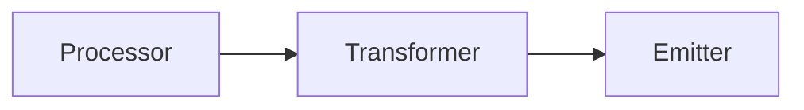

# Transformers

Transformers modify data before it reaches emitters. Use them to rename fields, add computed values, filter data, or adapt to your schema.

---

## What are Transformers?

A transformer is a function that takes data and returns modified data:

```python
def my_transformer(data: dict) -> dict:
    """Transform data"""
    return modified_data
```

Transformers sit between processors and emitters:



---

## Basic Usage

### Set Transformer on Emitter

```python
def rename_fields(data: dict) -> dict:
    """Rename fields to match database schema"""
    return {
        "exchange": data["source"],
        "ticker": data["symbol"],
        "timestamp": data["open_ts"],
        "price": data["close"]
    }

# Apply to emitter
emitter.set_transformer(rename_fields)
```

### With PostgreSQL

```python
postgres = sf.PostgresEmitter(host="localhost", dbname="crypto")
postgres.set_model(MyTable)
postgres.set_transformer(rename_fields)  # Transform before saving
```

### With CSV

```python
csv = sf.CSVEmitter(
    source="Binance",
    symbol="BTCUSDT",
    timeframe="1m",
    file_path="data.csv",
    transformer_function=rename_fields  # Pass in constructor
)
```

---

## Common Transformers

### 1. Rename Fields

Map StreamForge fields to your schema:

```python
def rename_transformer(data: dict) -> dict:
    """Database uses different column names"""
    return {
        "exchange": data["source"],      # source → exchange
        "ticker": data["symbol"],        # symbol → ticker
        "tf": data["timeframe"],         # timeframe → tf
        "timestamp": data["open_ts"],    # open_ts → timestamp
        "o": data["open"],
        "h": data["high"],
        "l": data["low"],
        "c": data["close"],
        "v": data["volume"]
    }
```

**Use case:** Your database has different column names than StreamForge defaults.

### 2. Filter Fields

Keep only what you need:

```python
def filter_fields(data: dict) -> dict:
    """Keep only essential fields"""
    return {
        "source": data["source"],
        "symbol": data["symbol"],
        "timeframe": data["timeframe"],
        "open_ts": data["open_ts"],
        "close": data["close"],      # Only close price
        "volume": data["volume"]     # Only volume
        # Removed: open, high, low, end_ts
    }
```

**Use case:** Save storage space, simplify schema.

### 3. Add Computed Fields

Calculate additional metrics:

```python
def add_computed_fields(data: dict) -> dict:
    """Add technical indicators"""
    return {
        **data,  # Keep all original fields
        # Add new fields
        "price_range": data["high"] - data["low"],
        "price_change": data["close"] - data["open"],
        "price_change_pct": ((data["close"] - data["open"]) / data["open"]) * 100,
        "is_bullish": data["close"] > data["open"],
        "body_size": abs(data["close"] - data["open"]),
        "upper_wick": data["high"] - max(data["open"], data["close"]),
        "lower_wick": min(data["open"], data["close"]) - data["low"],
    }
```

**Use case:** Pre-calculate metrics for analysis.

### 4. Convert Units

Change data units or scale:

```python
def convert_units(data: dict) -> dict:
    """Convert volume to millions"""
    return {
        **data,
        "volume": data["volume"] / 1_000_000,  # Convert to millions
        "volume_unit": "millions",
        "volume_usd": data["volume"] * data["close"]  # Add USD value
    }
```

**Use case:** Normalize units, add derived metrics.

### 5. Format Timestamps

Convert timestamps to different formats:

```python
from datetime import datetime

def format_timestamps(data: dict) -> dict:
    """Add human-readable timestamp"""
    return {
        **data,
        "open_datetime": datetime.fromtimestamp(data["open_ts"] / 1000).isoformat(),
        "date": datetime.fromtimestamp(data["open_ts"] / 1000).date().isoformat()
    }
```

**Use case:** Easier datetime queries, human-readable exports.

---

## Advanced Transformers

### Stateful Transformer

Maintain state across transformations:

```python
class StatefulTransformer:
    """Transformer with internal state"""
    
    def __init__(self):
        self.count = 0
        self.running_total = 0
    
    def transform(self, data: dict) -> dict:
        """Add sequence number and running average"""
        self.count += 1
        self.running_total += data["close"]
        
        return {
            **data,
            "sequence": self.count,
            "running_avg": self.running_total / self.count
        }

# Use it
transformer = StatefulTransformer()
emitter.set_transformer(transformer.transform)
```

### Conditional Transformer

Apply different transformations based on conditions:

```python
def conditional_transformer(data: dict) -> dict:
    """Different transformations for different symbols"""
    
    # Base data
    result = data.copy()
    
    # Symbol-specific logic
    if data["symbol"] == "BTCUSDT":
        result["asset_class"] = "crypto"
        result["is_btc"] = True
    elif data["symbol"] == "ETHUSDT":
        result["asset_class"] = "crypto"
        result["is_btc"] = False
    
    # Price-based logic
    if data["close"] > 50000:
        result["price_level"] = "high"
    elif data["close"] > 30000:
        result["price_level"] = "medium"
    else:
        result["price_level"] = "low"
    
    return result
```

### Chained Transformers

Apply multiple transformations:

```python
def transform_1(data: dict) -> dict:
    """First transformation"""
    return {**data, "step1": True}

def transform_2(data: dict) -> dict:
    """Second transformation"""
    return {**data, "step2": True}

def chained_transformer(data: dict) -> dict:
    """Apply multiple transformations"""
    data = transform_1(data)
    data = transform_2(data)
    return data

emitter.set_transformer(chained_transformer)
```

---

## Complete Examples

### Example 1: Database Schema Mapping

Your database has custom column names:

```python
import asyncio
import streamforge as sf
from sqlalchemy.orm import declarative_base
from sqlalchemy import Column, String, Float, BigInteger

Base = declarative_base()

class CustomKlineTable(Base):
    """Custom schema"""
    __tablename__ = 'custom_klines'
    
    exchange = Column(String, primary_key=True)
    ticker = Column(String, primary_key=True)
    tf = Column(String, primary_key=True)
    timestamp = Column(BigInteger, primary_key=True)
    o = Column(Float)
    h = Column(Float)
    l = Column(Float)
    c = Column(Float)
    v = Column(Float)

def schema_mapper(data: dict) -> dict:
    """Map to custom schema"""
    return {
        "exchange": data["source"],
        "ticker": data["symbol"],
        "tf": data["timeframe"],
        "timestamp": data["open_ts"],
        "o": data["open"],
        "h": data["high"],
        "l": data["low"],
        "c": data["close"],
        "v": data["volume"]
    }

async def main():
    postgres = (sf.PostgresEmitter(host="localhost", dbname="crypto")
        .set_model(CustomKlineTable)
        .set_transformer(schema_mapper)  # Apply transformer
        .on_conflict(["exchange", "ticker", "tf", "timestamp"])
    )
    
    stream = sf.DataInput(
        type="kline",
        symbols=["BTCUSDT"],
        timeframe="1m"
    )
    
    runner = sf.BinanceRunner(stream_input=stream)
    runner.register_emitter(postgres)
    
    await runner.run()

asyncio.run(main())
```

### Example 2: Technical Indicators

Add computed technical indicators:

```python
def add_indicators(data: dict) -> dict:
    """Add technical analysis fields"""
    
    # Price metrics
    price_change = data["close"] - data["open"]
    price_change_pct = (price_change / data["open"]) * 100
    
    # Candle metrics
    body_size = abs(price_change)
    upper_shadow = data["high"] - max(data["open"], data["close"])
    lower_shadow = min(data["open"], data["close"]) - data["low"]
    total_range = data["high"] - data["low"]
    
    return {
        **data,
        # Price changes
        "price_change": price_change,
        "price_change_pct": price_change_pct,
        
        # Candle type
        "is_bullish": data["close"] > data["open"],
        "is_doji": body_size < (total_range * 0.1),
        
        # Candle components
        "body_size": body_size,
        "upper_shadow": upper_shadow,
        "lower_shadow": lower_shadow,
        "total_range": total_range,
        
        # Ratios
        "body_ratio": body_size / total_range if total_range > 0 else 0,
        "upper_shadow_ratio": upper_shadow / total_range if total_range > 0 else 0,
        "lower_shadow_ratio": lower_shadow / total_range if total_range > 0 else 0,
    }

# Use with CSV
csv = sf.CSVEmitter(
    source="Binance",
    symbol="BTCUSDT",
    timeframe="1m",
    file_path="btc_with_indicators.csv",
    transformer_function=add_indicators
)
```

### Example 3: Data Validation

Filter and validate data:

```python
def validate_and_clean(data: dict) -> dict:
    """Validate and clean data"""
    
    # Ensure positive values
    if data["open"] <= 0 or data["high"] <= 0 or data["low"] <= 0 or data["close"] <= 0:
        raise ValueError(f"Invalid price data: {data}")
    
    # Ensure high >= low
    if data["high"] < data["low"]:
        raise ValueError(f"High < Low: {data}")
    
    # Ensure volume is non-negative
    if data["volume"] < 0:
        data["volume"] = 0
    
    # Round prices to 2 decimals
    return {
        **data,
        "open": round(data["open"], 2),
        "high": round(data["high"], 2),
        "low": round(data["low"], 2),
        "close": round(data["close"], 2),
        "volume": round(data["volume"], 8)
    }

emitter.set_transformer(validate_and_clean)
```

---

## Transformer with Backfilling

Apply transformers during historical data loading:

```python
def my_transformer(data: dict) -> dict:
    return {
        **data,
        "price_change_pct": ((data["close"] - data["open"]) / data["open"]) * 100
    }

backfiller = sf.BinanceBackfilling(
    symbol="BTCUSDT",
    timeframe="1m",
    from_date="2024-01-01",
    to_date="2024-12-31"
)

backfiller.set_transformer(my_transformer)
backfiller.register_emitter(emitter)
backfiller.run()
```

---

## Performance Considerations

### Keep Transformers Fast

Transformers run on every data point:

```python
# ✓ Good - simple operations
def fast_transformer(data: dict) -> dict:
    return {
        **data,
        "price_change": data["close"] - data["open"]
    }

# ✗ Slow - heavy computation
def slow_transformer(data: dict) -> dict:
    # Don't do this on every data point!
    import time
    time.sleep(1)  # Blocks pipeline
    return data
```

### Avoid External API Calls

Don't make network requests in transformers:

```python
# ✗ Bad - blocks on every data point
def bad_transformer(data: dict) -> dict:
    response = requests.get("https://api.example.com/rate")  # Slow!
    data["exchange_rate"] = response.json()["rate"]
    return data

# ✓ Good - cache external data
class CachedTransformer:
    def __init__(self):
        self.exchange_rate = self.fetch_rate()
    
    def fetch_rate(self):
        # Fetch once
        return requests.get("https://api.example.com/rate").json()["rate"]
    
    def transform(self, data: dict) -> dict:
        return {
            **data,
            "exchange_rate": self.exchange_rate  # Use cached value
        }
```

---

## Testing Transformers

Test transformers in isolation:

```python
def my_transformer(data: dict) -> dict:
    return {
        **data,
        "price_change": data["close"] - data["open"]
    }

# Test it
test_data = {
    "source": "Binance",
    "symbol": "BTCUSDT",
    "timeframe": "1m",
    "open_ts": 1735689600000,
    "end_ts": 1735689659999,
    "open": 43250.00,
    "high": 43275.00,
    "low": 43240.00,
    "close": 43260.00,
    "volume": 12.45
}

result = my_transformer(test_data)
print(result)

assert "price_change" in result
assert result["price_change"] == 10.00
print("✓ Transformer test passed!")
```

---

## Best Practices

### 1. Use Type Hints

```python
def my_transformer(data: dict) -> dict:
    """
    Transform kline data.
    
    Args:
        data: Kline dictionary
        
    Returns:
        Transformed dictionary
    """
    return modified_data
```

### 2. Document Transformations

```python
def complex_transformer(data: dict) -> dict:
    """
    Apply multiple transformations:
    1. Rename fields for database schema
    2. Add price change percentage
    3. Add technical indicators
    4. Round prices to 2 decimals
    """
    # Implementation
```

### 3. Keep Original Data

Use spread operator to preserve original:

```python
def safe_transformer(data: dict) -> dict:
    return {
        **data,  # Keep original
        "new_field": "value"  # Add new
    }
```

### 4. Handle Missing Fields

```python
def robust_transformer(data: dict) -> dict:
    """Handle optional fields"""
    return {
        **data,
        "price_change": data.get("close", 0) - data.get("open", 0)
    }
```

---

## Common Patterns

### Pattern 1: Rename for Schema

```python
def rename_for_db(data: dict) -> dict:
    return {
        "db_field_1": data["source"],
        "db_field_2": data["symbol"],
        # ... map all fields
    }
```

### Pattern 2: Add Computed Fields

```python
def add_metrics(data: dict) -> dict:
    return {
        **data,
        "metric1": compute_metric1(data),
        "metric2": compute_metric2(data)
    }
```

### Pattern 3: Filter and Clean

```python
def clean_data(data: dict) -> dict:
    return {
        k: v for k, v in data.items()
        if k in ["field1", "field2", "field3"]
    }
```

---

## Next Steps

- [Aggregation →](aggregation.md) - Multi-timeframe streaming
- [Examples →](../examples/data-transformation.md) - See transformers in action
- [API Reference →](../api-reference/emitters.md) - Emitter API details

